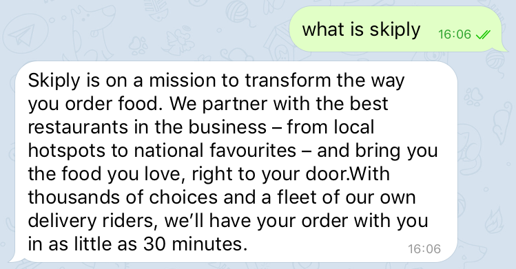
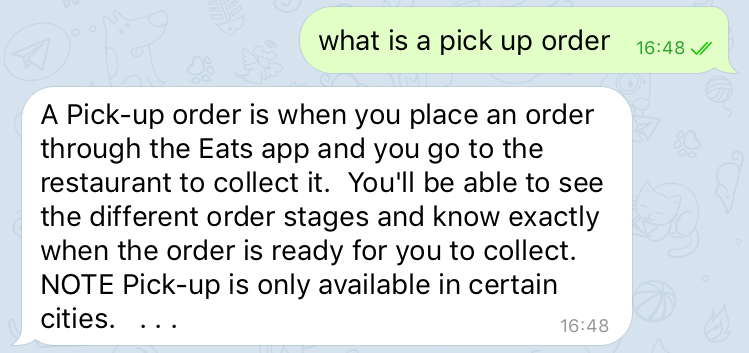
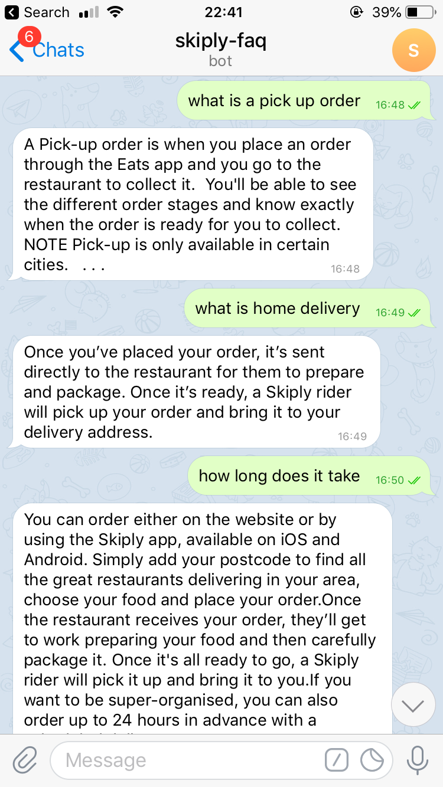
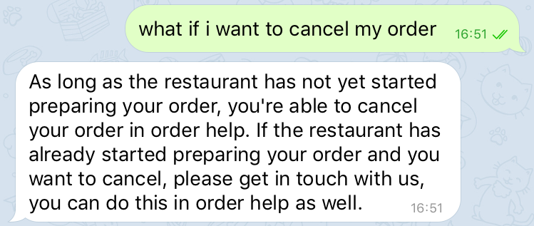
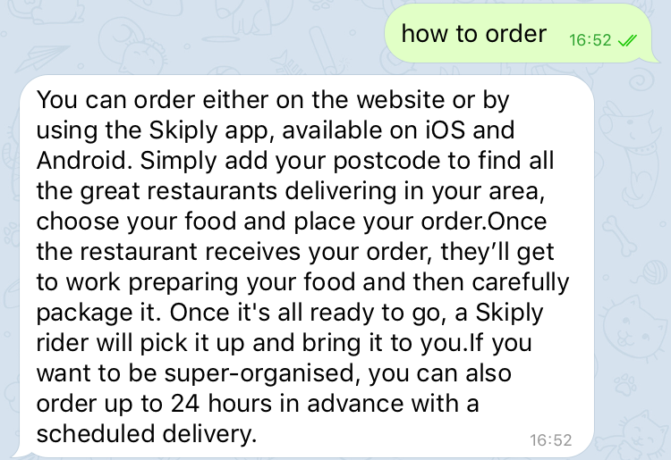

# faq-bot

## Scraping the web

[<code>deliveroo.py</code>](https://github.com/adyanehtesham/faq-bot/blob/master/deliveroo.py) 
and [<code>uberEats.py</code>](https://github.com/adyanehtesham/faq-bot/blob/master/uberEats.py) 
are python programs that scrape Deliveroo and Uber Eats FAQs and stores that in respective .csv files.

[<code>merge.py</code>](https://github.com/adyanehtesham/faq-bot/blob/master/merge.py) 
then takes the two csv files and combines all the questions and answers into 
[<code>skiply.csv</code>](https://github.com/adyanehtesham/faq-bot/blob/master/skiply.csv)

## Data cleansing

[<code>csvToRasa.py</code>](https://github.com/adyanehtesham/faq-bot/blob/master/csvToRasa.py) takes <code>skiply.csv</code> 
and cleanses it into a YAML format so it can be used as training data for the Rasa bot.

## Data analytics

[<code>analytics.py</code>](https://github.com/adyanehtesham/faq-bot/blob/master/analytics.py) 
performs some linguistic analytics that showcases the most commonly used words and extra information that can show you the difficulty of the language involved.

## Usage

Although you have all the data needed in this repository to make the bot functional you will need to do the following if starting from scratch.

Also this guide is for Linux because I used ngrok to host the bot.

### Install Rasa

You can install Rasa Open Source using pip (requires Python 3.6, 3.7 or 3.8).

```bash
pip3 install -U pip
pip3 install rasa
```

### Initialise a Rasa project

You will need to create a new project by running:

```bash
rasa init
```

### Scrape the web and make training data

clone this repository:

```bash
git clone https://github.com/adyanehtesham/faq-bot.git
```

then run all the python files (obviously if this was a serious product I would put it all in one, first time tho):

```bash
python3 deliveroo.py
python3 uberEats.py
python3 merge.py
```

### Adding training data and training the bot

to add the training data run:

```bash
python3 csvToRasa.py
```

move to the rasa directory with <code>cd Rasa</code>

train the model:

```bash
rasa train
```

if you want to talk to the bot yourself:

```bash
rasa shell
```

(I have become lazy so just follow the [Rasa Docs](https://rasa.com/docs/) to figure out how to deploy this yourself.

I deployed it on telegram and to converse with it you need to message the bot with the @skiplyFAQBot username.

Buy you can't because it probably won't be running. I need to run it from my computer manually :P

Here's proof tho:

</img>

</img>

Here is the whole screen so it doesn't seem fake or anything.

</img>

</img>

</img>

### Oh and also

if you want to see the data anlaytics stuff run:

```bash
python3 analytics.py
```
